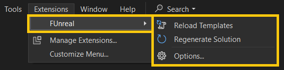

# FUnreal - Unreal Engine Extension for Visual Studio

 

`FUnreal` is an extension for **Visual Studio** with the aim of improve workflow of **Unreal Engine** **C++ developers**.

Basically if you've got to the point where you write all your code in one file just because the hassle of adding new files to the project (here I am :raised_hand:), this extension is for you :wink:.

*Just a taste of FUnreal in action*

The main concept is an handy context menu in the **Solution Explorer** view to reach - *just a right-click away* - a bunch of useful operations without the need to launch an *Unreal Engine Editor* instance (as for creating plugins or common classes) or alternately working on the filesystem side (adding, renaming or deleting files) and then launching *Unreal Build Tool*.

Futhermore `FUnreal` will try to maintain consistent your project, updating UE descriptor files and sources depending on the scenario, so that you can keep the focus on writing code.

# Features
`FUnreal` currently supports:
* UE: 4.x and 5.x Game C++ Projects
* IDE: Visual Studio 2022 (aka v17.x)
* OS: Windows

and offers the following features:
* Create/Rename/Delete `files` and `folders` (even empty folders will be visibles and manageables)
* Create `C++ classes` choosing from *Unreal Common Classes* or *User Defined* templates
* Create/Rename/Delete `plugins` choosing from *Unreal Plugin Templates* or *User Defined* templates
* Create/Rename/Delete `modules` (for plugin modules and game modules) choosing from *Unreal Templates* or *User Defined* templates
* `Keep in Sync` UE Project and VS Solution (invoking UBT automatically)
* `Keep consistent` the code base, updating properly *.uproject, .uplugin, .Build.cs, .Target.cs*, module source file, and C++ include file directive, even cross modules, depenging on the operation executed (look at [this section](#details) for more details).

> NOTE: While using `FUnreal` extension, it is still possible to create plugins and C++ classes from Unreal Editor, from other IDE plugins or doing operations on the project directly on filesystem. The important thing is that UBT has been run succesfully and VS Solution has been reloaded.

# Activation
`FUnreal` starts automatically when detects an UE Project, even if the actual activation dependends on Visual Studio extension loading chain (so you couldn't see the context menu right away just after opening VS). Anyway, you can be aware when `FUnreal` have been loaded in two ways:
* A temporary notification message in **VS Status Bar**
* A dedicated Output window named **FUnreal**

# Usage
Once active, `FUnreal` features are accessible via:
- a `Context Menu` on solution explorer items
- a `Toolbar Menu` to access configuration and run specific commands

## Context Menu
`FUnreal` context menu is available in the **Solution Explorer** view on the following items:
* `Game Project` and `.uproject` file
* `Plugin directory` and `.uplugin` file
* `Module directory` and `.Build.cs` file (for both plugin modules and game modules)
* Any `folder` or `file` within a Module directory (or multiple selection of them)

> On these items, you should find `FUnreal` menu at the very first position of the context menu.

After performing the selected operation, `FUnreal` will run **Unreal Build Tool**, so you should receive at end the usual VS dialog advising that the project has been modified externally and need to be reloaded.

> Take a look at [video page samples](docs/VIDEOS.md) to see `FUnreal` in action!

## Toolbar Menu
This `FUnreal` menu is located on the the main VS Toolbar under `Extensions` menu.

From there you can:
- Force reloading templates (in case you change your custom template on disk)
- Access options page, where you can configure the extension (e.g for tuning template configuration)

> More info about `FUnreal` options and custom templates configuration can be found at [this page](docs/TEMPLATES.md).

# Details
Read [here](./docs/DETAILS.md) for an insights on what `FUnreal` does for you under the hood.

# Changelog
History of changes [here](./docs/CHANGELOG.md).