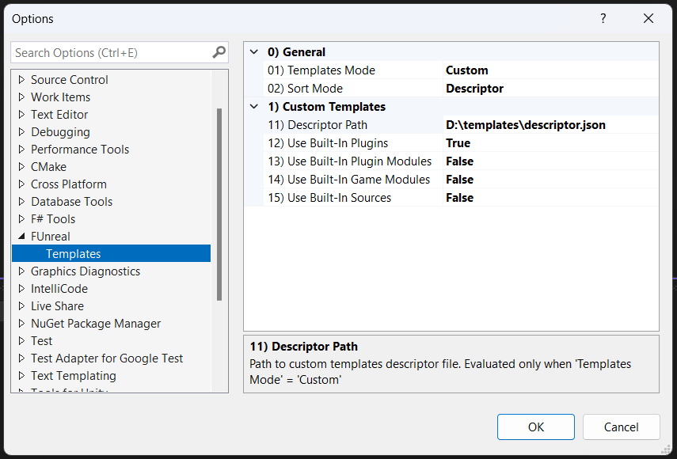

# Templates
This page describes how you can configure and import properly custom templates for plugins, modules and classes into `FUnreal`.

Basically to define a template, three steps are required:
1. Write down the templates configuration in a descriptor file (see [Descriptor Schema](#decriptor-file-schema)).
2. Produce the template folder and files taking advantage of some hooks (placeholders) that will be replaced with the right values when creating contents using FUnreal features (see [Template Hooks](#template-hooks)).
3. Make `FUnreal` aware of the custom descriptor file or a possible templates update (see [Extension Setup](#extension-setup)).

On the filesystem side templates are expected to be organzed like this:
```json
- path/to/templates
   - <folders>            // you can organized your templates in relative folders (and subfolders) as you need
   - yourdescriptor.json  // the descriptor file that will be necessary configure in FUnreal Option page. 
```
 
> As a [live example](../FUnreal/Templates/) you can check how `FUnreal` built-in templates are defined.

# Table of Contents
* [Descriptor Schema](#decriptor-file-schema)
  * [Plugin Schema](#plugin-schema)
  * [Plugin Module Schema](#plugin-module-schema)
  * [Game Module Schema](#game-module-schema)
  * [Class Schema](#class-schema)
* [Template Hooks](#template-hooks)
  * [Plugin Hooks](#plugin-hooks)
  * [Plugin Module Hooks](#plugin-module-hooks)
  * [Game Module Hooks](#game-module-hooks)
  * [Class Hooks](#class-hooks)
* [Extension Setup](#extension-setup)


# Descriptor File Schema

Entrypoint for user defined templates is a descriptor file in JSON format with the following base structure:

```json
{
    "version"        : " ",    // schema version
    "plugins"        : [ ],    // template definition for plugins
    "plugin_modules" : [ ],    // template definition for plugin modules
    "game_modules"   : [ ],    // template definition for game modules
    "classes"        : [ ],    // template definition for class files
}
```

> Current `FUnreal` release supports descriptor `"version" : "1.0"`

### Template Base Schema
Every template needs the following informations:

| Attribute | Type   | Required | Description                                   | 
| --------- | ------ | -------- | --------------------------------------------- | 
| label     | string | YES      | Template label shown on the UI                | 
| desc      | string | YES      | Template description shown on the UI          | 
| ue        | array  | YES      | Supported UE major versions by this template  | 
| path      | string | YES      | Path to template files. Must be a relative path to the descriptor file | 
| meta      | object | YES      | Metadata depending on the specific template   |

## Plugin Schema
To define a plugin, [Base Schema](#template-base-schema) must be honored.
Futhermore, it requires the following metadata:

| Attribute  | Type   | Required | Description                                                 | 
| ---------- | ------ | -------- | ----------------------------------------------------------- | 
| has_module | bool   | YES      | Specify if the plugin template contains a templated module. | 

### Example
Plugin template compatible with UE 4 and 5, that contains a templated module:

```json
{
    "label" : "My Plugin",
    "desc"  : "My Plugin description",
    "ue"    : ["4", "5"],
    "path"  : "relpath/to/plugin/folder",
    "meta"  : {
        "has_module" : true
    }
}
```

## Plugin Module Schema
To define a plugin module, [Base Schema](#template-base-schema) must be honored.
Futhermore, it requires the following metadata:

| Attribute  | Type   | Required | Description                                                 | 
| ---------- | ------ | -------- | ----------------------------------------------------------- | 
| type       | string | YES      | This correspond to module `Type` field foreseen by `.uplugin` format  | 
| phase      | string | YES      | This correspond to module `LoadingPhase` field foreseen by `.uplugin` format | 

### Example
Plugin Module template compatible with UE 4 and 5, loaded in editor with default phase:

```json
{
    "label" : "My Plugin Module",
    "desc"  : "My Plugin Module description",
    "ue"    : ["4", "5"],
    "path"  : "relpath/to/plugin/module/folder",
    "meta"  : {
        "type"  : "Editor",
        "phase" : "Default",
    }
}
```

## Game Module Schema
To define a game module, [Base Schema](#template-base-schema) must be honored.
Futhermore, it requires the following metadata:

| Attribute  | Type   | Required | Description                                                 | 
| ---------- | ------ | -------- | ----------------------------------------------------------- | 
| type       | string | YES      | This correspond to module `Type` field foreseen by [.uplugin file format](https://dev.epicgames.com/documentation/en-us/unreal-engine/plugins-in-unreal-engine?application_version=5.3) | 
| phase      | string | YES      | This correspond to module `LoadingPhase` field foreseen  [.uplugin file format](https://dev.epicgames.com/documentation/en-us/unreal-engine/plugins-in-unreal-engine?application_version=5.3) | 
| target     | string | YES      | This correspond to [UBT target types](https://dev.epicgames.com/documentation/en-us/unreal-engine/unreal-engine-build-tool-target-reference?application_version=5.3): Game, Client, Server, Editor, Program | 

### Example
Game Module template compatible with UE 4 and 5, loaded in editor with default phase for game build target:
```json
{
    "label" : "My Game Module",
    "desc"  : "My Game Module description",
    "ue"    : ["4", "5"],
    "path"  : "relpath/to/module/folder",
    "meta"  : {
        "type"   : "Editor",
        "phase"  : "Default",
        "target" : "Game"
    }
}
```

## Class Schema
To define a class, [Base Schema](#template-base-schema) must be honored.
Futhermore, it requires the following metadata:

| Attribute  | Type   | Required | Description                                                 | 
| ---------- | ------ | -------- | ----------------------------------------------------------- | 
| header     | string | YES      | Header file name located at path declared in the `path` attribute | 
| source     | string | YES      | Source file name located at path declared in the `path` attribute | 

### Example
Class template compatible with UE 4 and 5:
```json
{
    "label" : "My Class",
    "desc"  : "My Class description",
    "ue"    : ["4", "5"],
    "path"  : "relpath/to/classes",
    "meta"  : {
        "header" : "MyClass.h",
        "source" : "MyClass.cpp"
    }
}
```

# Template Hooks
While implementing a custom template you may use some placeholders and allow `FUnreal` to fullfill them with the right information.
Those placeholders can be obviously used within files, but also can be used to customize template paths.

> A placeholder to be recognized by FUnreal, must be wrapped by `@{...}`.

Here follow the available hooks for each template type.

> As a [live example](../FUnreal/Templates/) you can check how `FUnreal` built-in templates are defined.

## Plugin Hooks
| Attribute      |  Description                                       | 
| -------------- | -------------------------------------------------- | 
| TPL_PLUG_NAME  | Plugin name coming from UI while creating a plugin | 
| TPL_MODU_NAME  | Module name coming from UI while creating a plugin | 
| TPL_MODU_CLASS | Module class name computed from FUnreal. To the TPL_MODU_NAME is appended the token `Module` if not already there |

## Plugin Module Hooks
| Attribute      |  Description                                       | 
| -------------- | -------------------------------------------------- | 
| TPL_MODU_NAME  | Module name coming from UI while creating a plugin | 
| TPL_MODU_CLASS | Module class name computed from FUnreal. To the TPL_MODU_NAME is appended the token `Module` if not already there |

## Game Module Hooks
| Attribute      |  Description                                       | 
| -------------- | -------------------------------------------------- | 
| TPL_MODU_NAME  | Module name coming from UI while creating a plugin | 
| TPL_MODU_CLASS | Module class name computed from FUnreal. To the TPL_MODU_NAME is appended the token `Module` if not already there |

## Class Hooks
| Attribute      |  Description                                       | 
| -------------- | -------------------------------------------------- | 
| TPL_MODU_API   | Module api macro. Empty if class is set to Private on the UI during creation. Otherwise (Public), valorized properly | 
| TPL_SOUR_CLASS | Class name coming from UI while creating a class |
| TPL_SOUR_INCL  | Include path coming from UI while creating a class. Basically a relative folder path that will contains the class files |

# Extension Setup
Once you templates and descriptor file are ready, you can make FUnreal aware of them.
Depending on the scenario you can use one the following methods:

## Custom Template Configuration
In case you need to change template setup, you can access FUnreal Option page from VS main toolbar: `Extensions -> FUnreal -> Options ...` and play with the properties.



### General Properties
| Property       |  Description                                       | 
| -------------- | -------------------------------------------------- | 
| Templates Mode | Select templates mode to be used: Built-in (use only templates provided by FUnreal) or Custom (allow to use user-defined ones)" | 
| Sort Mode      | Select templates sort mode to be used: Alphanumeric (by Label) or Descriptor (following order declaration in descriptor file) |

### Custom Templates Properties
These properties are evaluated only if `Templates Mode` is set to `Custom`.

| Property                    |  Description                                       | 
| --------------------------- | -------------------------------------------------- | 
| Descriptor Path             | Path to custom templates descriptor file | 
| Use Built-In Plugins        | Load built-in Plugin templates |
| Use Built-In Plugin Modules | Load built-in Plugin Module templates |
| Use Built-In Game Modules   | Load built-in Game Module templates |
| Use Built-In Classes        | Load built-in Class templates |

>  FUnreal requires that at least 1 template for each template type exist. So, in case you want only define template for a specific type, you can use the Built-in templates for the others.

## Contents Update
In case you just update the descriptor file contents then you can ask FUnreal to refresh the templates from VS main toolbar `Extensions -> FUnreal -> Reload Templates`